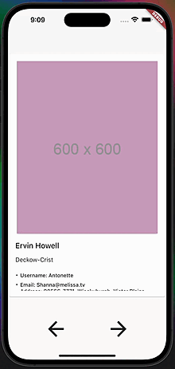

# Тестовое задание на должность Flutter dev

## Демонстрация

Приложение протестировано на iOS и Android

Уважаемый кандидат, вашим тестовым заданием будет реализация Tinder-like
приложения на основе mock-API с использованием пакета flutter_bloc.

## Критерии оценки:

- Использование виджетов для построения UI. Корректность виджета для
выполнения задачи, преиспользуемость виджетов, уровень разделенности
элементов в виджетах

- Работа с BLoC. Разделение на разные BLoC по задачам, работа со
стейтами, обработка ошибок

- Работа с API. Выделение сущностей, разделение data-слоя

## Описание UI

Приложение состоит из одного экрана. На нем пользователь может смотреть
на пользователей приложения, читать их описание и переключаться между их
карточками.

Карточка пользователя - основной элемент UI, занимает все верхнее пространство. Карточка состоит из:

- фото профиля (первое фото в списке альбомов пользователя)

- имени пользователя как заголовка карточки

- названия рабочей кампании пользователя как подзаголовка карточки

- текстового описания (вся остальная текстовая информация, которая доступна пользователю, перечисленная в bullet-списке). 

Фото карточки занимает большую часть виджета, при нажатии на фото открывается диалог, в котором можно посмотреть все фото из альбома пользователя. Ниже отображается имя пользователя полностью, может занимать несколько строк. Название компании занимает одну строку и обрезается с помощью троеточия, если не помещается в ширину карточки. Карточка должна быть скроллящейся, чтобы была возможность полностью просмотреть описание профиля.

### Переключатель карточек

Зафиксирован внизу страницы. Содержит две кнопки - стрелочку назад и стрелочку вперед - по нажатию которых происходит переход к следующей карточке пользователя. Переключение должно быть цикличным и не ограниченным кол-вом карточек в списке. Переключатель не меняет свое положение при изменении карточки

## Описание API
Для реализации данного задания необходимо использовать Mock-API, предоставленный сервисом https://jsonplaceholder.typicode.com/.

Вам понадобится:

- Запрос на пользователей

- Запрос для получения альбомов пользователя

Вы не ограничены в реализации data-слоя, но для вывода данных на UI необходимо использовать Bloc, поставляемый с пакетом flutter_bloc.

## Требования по реализации

Ожидаемое время на выполнения задания: 4 часа.

Красота исполнения UI не имеет ценности в рамках данного тестового задания.